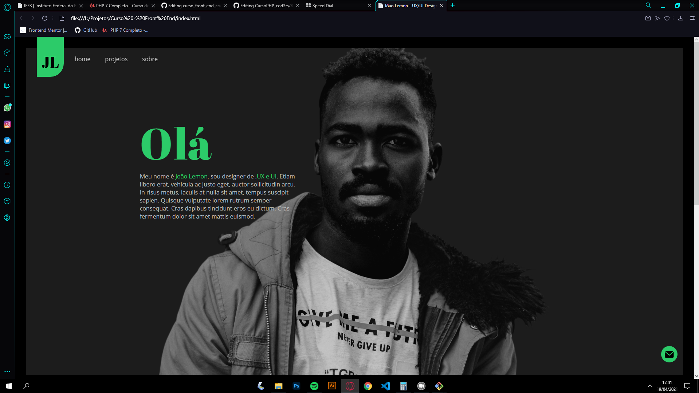

<h1> Curso de JavaScript - Codesigners </h1> 

<li> Este repositório contém os exercícios feitos no curso de Front-End (Em andamento) </li>
<li> <a href="https://www.udemy.com/course/front-end-essencial">Link do curso</a> </li>

<h2> Screenshots do Curso <h2>
 
 

    
    
    
    
  
  
 

<h3> <strong> Módulo atual: </strong> </h3>
<h4> Arrays | Aula 84 </h4>

<h2> Minhas redes sociais <h2> 

 
 

